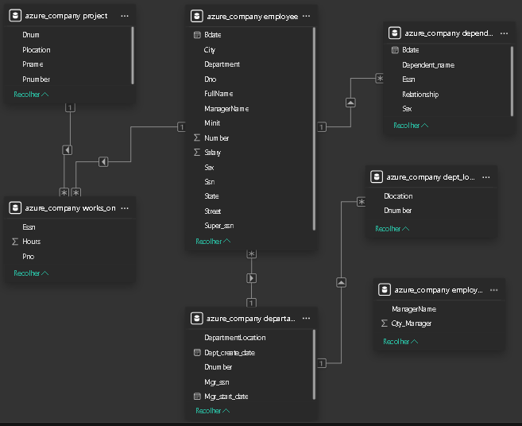
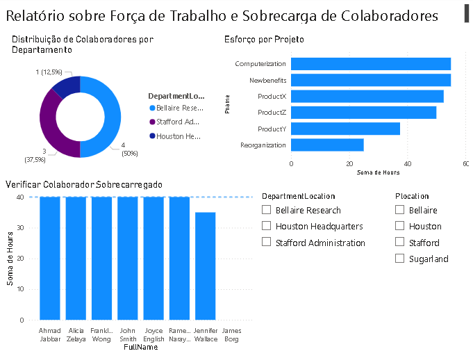

# Desafio de Projeto: Coleta e Processamento de Dados com MySQL Azure e Power BI

## 📝 Descrição do Projeto
Este projeto consistiu na criação de uma infraestrutura de dados completa, integrando uma instância de banco de dados **MySQL na Azure** com o **Power BI**. O foco principal foi a aplicação de técnicas avançadas de ETL (Extract, Transform, Load) e modelagem de dados para transformar uma base relacional bruta em um dashboard corporativo funcional e informativo.

## 🛠️ Jornada de Desenvolvimento

### 1. Configuração da Infraestrutura na Nuvem
- **Azure Database for MySQL:** Criação e configuração de uma instância de banco de dados na nuvem Microsoft Azure.
- **Segurança de Acesso:** Configuração de regras de firewall para permitir a comunicação entre o servidor Azure e as ferramentas locais (MySQL Workbench e Power BI Desktop).
- **Conexão:** Estabelecimento de conexão via Workbench para a execução dos scripts de definição (DDL) e manipulação de dados (DML).

### 2. Implementação e Povoamento do Banco de Dados
- **Criação do Schema:** Implementação das tabelas `employee`, `departament`, `dept_locations`, `project`, `works_on` e `dependent`.
- **Integridade Referencial:** Configuração rigorosa de chaves primárias e chaves estrangeiras para garantir a consistência dos dados.

### 💡 Solução de Problemas Técnicos (Troubleshooting)

**1. Tratamento de Dependências Circulares:**
Durante o povoamento, o MySQL bloqueou as inserções devido a restrições de chaves estrangeiras (ex: colaboradores que precisavam de departamentos que ainda não haviam sido processados).
* **Solução:** O script de inserção foi executado utilizando `SET FOREIGN_KEY_CHECKS = 0;` no início e `SET FOREIGN_KEY_CHECKS = 1;` ao final, permitindo a carga inicial sem comprometer as regras de integridade do banco.

**2. Correção de Nomenclatura via ETL:**
Identificou-se um erro de digitação na tabela original (`departament`). Seguindo as boas práticas de não alterar a estrutura da fonte (produção), a correção para `department` foi realizada diretamente na camada de transformação do Power BI.

### 3. Transformação de Dados (Power Query)
A etapa de ETL foi a mais minuciosa, garantindo a limpeza e a usabilidade dos dados:

- **Tipagem e Moeda:** A coluna `Salary` foi convertida para **Número Decimal Fixo** para assegurar precisão em cálculos financeiros.
- **Tratamento de Datas:** Colunas de data foram formatadas exclusivamente como **Data**, eliminando informações de hora que não agregavam valor ao modelo.
- **Limpeza de Strings (O Caso Ramesh):** Corrigiu-se uma inconsistência no endereço do colaborador Ramesh, onde um hífen extra no nome da rua ("Fire-Oak") impedia a divisão correta. Utilizou-se a função de substituição de valores para normalizar a string.
- **Desmembramento de Endereço:** A coluna `Address` foi dividida em quatro novas colunas: `Número`, `Rua`, `Cidade` e `Estado`.
- **Nome Completo:** Mescla das colunas `Fname` e `Lname`. A coluna `Minit` (inicial do meio) foi propositalmente omitida para manter a limpeza visual conforme o padrão exibido nos requisitos do desafio.
- **Tratamento de Nulos:** - Verificou-se que apenas o gerente geral (CEO) possuía o campo `Super_ssn` nulo.
    - Departamentos sem gerentes foram validados e preenchidos conforme os dados de suporte.
- **Mesclas de Tabelas (Joins):**
    - **Employee + Departament:** Junção para associar o nome do departamento a cada colaborador.
    - **Auto-relação (Self-Join):** Mescla da tabela `employee` com ela mesma para associar o nome do gerente a cada colaborador subordinado.
    - **Departamento + Localização:** Mescla para criar combinações únicas de Local/Departamento, essencial para o modelo dimensional.
- **Agrupamento de Dados:** Criação de uma consulta acessória para contabilizar a quantidade de colaboradores por gerente.

### 4. Modelagem de Dados e Cardinalidade
- **Ajuste de Duplicatas:** Durante o processo, foi necessário aplicar a função **"Remover Duplicatas"** nas tabelas de dimensão (`employee` e `departament`) para eliminar "clones" gerados pelas mesclas de múltiplas localizações.
- **Configuração de Relacionamentos:** Estabelecimento manual de conexões entre as tabelas (Ssn para Essn, Dno para Dnumber, etc.) garantindo a cardinalidade **1:N (Um para Muitos)** e o funcionamento correto dos filtros cruzados.

> ****

## 🧠 Justificativas Teóricas

### Mesclar (Merge) vs. Acrescentar (Append)
Neste projeto, a operação de **Mesclar** foi utilizada para unir tabelas horizontalmente (como o JOIN do SQL), adicionando colunas de localização e nomes de departamentos aos registros. O **Acrescentar** não foi utilizado pois ele serve para empilhar linhas verticalmente entre tabelas de mesma estrutura, o que não se aplicava à diversidade de dados deste schema.

## 📊 O Dashboard Final
O relatório foi construído para oferecer insights sobre a alocação de pessoal e custos:
- **Distribuição Setorial:** Gráfico de rosca demonstrando a dispersão da equipe por departamento.
- **Análise de Esforço:** Gráfico de barras identificando os projetos com maior carga horária acumulada.
- **Gestão de Sobrecarga:** Gráfico de colunas comparando as horas totais trabalhadas por cada colaborador com uma linha de referência de 40 horas semanais. O gerente James Borg aparece com 0 horas, refletindo sua posição puramente administrativa/supervisória no banco de dados.
- **Interatividade:** Filtros dinâmicos (slicers) por Localização do Departamento e Localização do Projeto.

> ****

---
**Projeto desenvolvido para Formação Power BI Analyst.**
